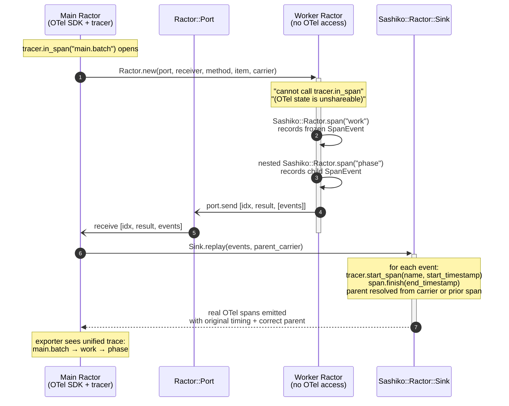
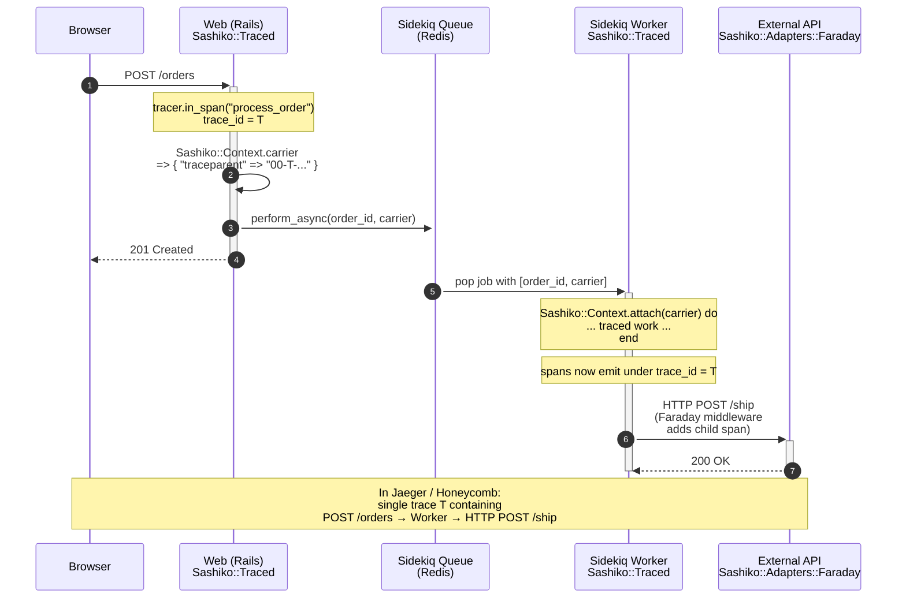
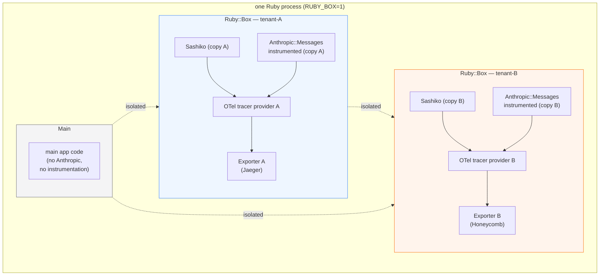

# Sashiko

> **The first Ruby library that emits OpenTelemetry spans from inside a Ractor.**
> Plus: declarative tracing, cross-boundary context propagation, Ruby::Box isolation.
> Built from the ground up for Ruby 4.

📖 **API docs**: <https://o6lvl4.github.io/sashiko/>

## Wait, Ractors can't emit OTel spans

Yes — in vanilla OpenTelemetry Ruby, they can't. The SDK's module state
carries unshareable instance variables (mutex, propagation), so any
`tracer.in_span(...)` call from inside a Ractor raises
`Ractor::IsolationError`. The OTel Ruby SIG has acknowledged this as a
blocker for Ractor adoption.

Sashiko works around this with **span replay**: inside the Ractor, work
is recorded as frozen `SpanEvent` values (no OTel dependency), shipped
back to the main Ractor via `Ractor::Port`, then re-emitted there as
real OTel spans with the original timestamps and correct parent
linkage. From the trace consumer's point of view, the spans look
exactly as if they were emitted inside the Ractor.



```
main.batch (20ms)                              ← main Ractor
├─ PrimePipeline.run (7.5ms) [item.index=0]    ← ← ← emitted "inside" a Ractor
│  ├─ enumerate                                ← ← ← nested Ractor-side span
│  ├─ sieve
│  └─ summarize
├─ PrimePipeline.run (13.5ms) [item.index=1]
│  └─ ...
└─ PrimePipeline.run (19.7ms) [item.index=2]
   └─ ...
```

Run the demo yourself:

```sh
bundle exec ruby examples/ractor_span_replay_demo.rb
```

See [the Ractor section](#sashikoractor--true-parallel-execution-with-span-replay-ruby-4)
for the API.

---

Declarative OpenTelemetry instrumentation for Ruby 4, with first-class
cross-boundary trace context propagation.

Named after *sashiko* (刺し子), a Japanese stitching technique that
reinforces fabric with small, deliberate stitches — the same way this
gem weaves small, deliberate spans into the fabric of your code.

---

## The problem

Plain OpenTelemetry Ruby drops trace context the moment work crosses a
boundary:

```
Without Sashiko:                 With Sashiko:

[trace A]                         [trace A]
└─ POST /orders                   └─ POST /orders
                                     └─ OrderWorker#perform
[trace B]   ← disconnected 😢        └─ HTTP POST warehouse.com
└─ OrderWorker#perform               └─ HTTP POST email.com
   └─ HTTP POST warehouse.com
```

Because `OpenTelemetry::Context` lives in fiber-local storage:

- A span started inside `Thread.new { ... }` becomes a **new root span**.
- A Sidekiq job has no link to the web request that enqueued it.
- Wrapping every method in `tracer.in_span("...") do ... end` is
  verbose and bleeds observability into business logic.

Sashiko fixes these three problems with three small APIs.

## Built for Ruby 4

Sashiko is designed from the ground up with Ruby 4's modern toolbox.
Each idiom is applied where it genuinely clarifies the code.

### The 4.0-exclusive headliners

| Ruby 4.0-new feature | Where it's used in Sashiko |
|---|---|
| **`Ractor::Port`** | `Sashiko::Ractor.parallel_map` — true parallel execution across cores using Ruby 4's new Port-based Ractor communication API. See `examples/ractor_demo.rb`. |
| **`Ruby::Box`** (experimental) | `Sashiko::Box.new_with_sashiko` + `Sashiko::Adapters::Anthropic.instrument_in_box!` — multi-tenant observability. Each Box has its own Sashiko, its own OTel tracer provider, its own instrumented classes, its own exporter. Zero cross-contamination. Full test suite runs under `RUBY_BOX=1` in CI. See [`examples/box_multitenant_demo.rb`](examples/box_multitenant_demo.rb). |
| **ZJIT-friendly design** | All instrumentation happens at class load time via `Module#prepend`; no runtime method rewrites, no `method_added` hooks, no dynamic `define_method` at call time. Inline caches stay warm. |
| **Ractor 4.0 new API (`Port`, `#value`)** | Used directly rather than the deprecated `.take` / `Ractor.yield` style. |

### Modern-Ruby idioms matured for 4.0

| Feature | Where in Sashiko |
|---|---|
| `Data.define` immutable values | `Sashiko::Traced::Options`, `Sashiko::Adapters::Anthropic::Price` — frozen, typed, Ractor-shareable by default |
| Pattern matching (`in` / deconstruct) | Attribute extraction in `Traced`, response parsing in Anthropic adapter, HTTP status classification in Faraday adapter |
| Endless methods (`def foo = …`) | Public accessors and one-line delegates throughout |
| `it` default block parameter | Filter/reject chains in `trace_all` |
| `Ractor.make_shareable` | `Sashiko::Context.carrier` returns a deep-frozen, Ractor-shareable Hash — one of the few things you can cleanly hand to a Ractor |
| Anonymous block forwarding (`&`) | `Sashiko::Context.with` / `#attach` delegate blocks with no named parameter |
| RBS signatures | Ship `sig/sashiko.rbs` for Steep users |
| Line-start logical operators | Language supports it; this codebase has no multi-line boolean conditions warranting it. Not forced in. |

### A look at the code

Attribute sources resolved with pattern matching (replaces the traditional
`respond_to?` chain):

```ruby
extra = case options.attributes
        in Proc => fn then fn.arity.zero? ? fn.call : fn.call(*args, **kwargs)
        in Hash => h  then h
        else nil
        end
```

Faraday adapter classifying HTTP status codes:

```ruby
case response.status
in 100..399     # ok, no-op
in Integer => code
  span.status = OpenTelemetry::Trace::Status.error("HTTP #{code}")
end
```

Ruby 4's `Ractor::Port` driving true CPU-parallel fanout:

```ruby
def parallel_map(items, via:)
  # ... shareability checks ...
  ports = items.each_with_index.map do |item, i|
    port = ::Ractor::Port.new
    ::Ractor.new(port, receiver, method_name, item, i, carrier) do |p, r, m, it, idx, _c|
      p.send([idx, r.public_send(m, it)])
    end
    port
  end
  # collect in input order...
end
```

## Quick start

```ruby
# Gemfile
gem "sashiko", github: "O6lvl4/sashiko"
gem "opentelemetry-sdk"
gem "opentelemetry-exporter-otlp"
```

```ruby
# config/initializers/otel.rb
require "opentelemetry/sdk"
require "opentelemetry/exporter/otlp"

OpenTelemetry::SDK.configure { it.service_name = "my-app" }

require "sashiko"
```

```ruby
class OrderService
  extend Sashiko::Traced

  trace :checkout, attributes: ->(order) { { "order.id" => order.id } }
  def checkout(order)
    charge(order)
    notify(order)
  end

  trace :charge
  trace :notify
  def charge(order); ...; end
  def notify(order); ...; end
end
```

Every call to `checkout` now produces a span named `OrderService#checkout`,
with `charge` and `notify` as children. Exceptions are recorded and the
span is marked as errored automatically.

## Core API

### `Sashiko::Traced` — declarative spans

```ruby
class Svc
  extend Sashiko::Traced

  # Wrap a single method.
  trace :work, attributes: ->(x) { { "work.id" => x.id } }

  # Wrap every method matching a pattern (declare AFTER the defs).
  trace_all matching: /^handle_/
end
```

`trace` options:
- `name:` — override the span name (defaults to `ClassName#method`).
- `kind:` — `:internal` (default), `:client`, `:server`, etc.
- `attributes:` — a `Proc` receiving the call arguments, or a static
  `Hash`. Pattern-matched against `Proc` / `Hash` shapes internally.
- `record_args: true` — include arg count as `code.args.count`.

### `Sashiko::Context` — propagation across Thread / Fiber

```ruby
# Thread.new that preserves the current OTel Context.
Sashiko::Context.thread { do_work }.join

# Fiber.new likewise.
Sashiko::Context.fiber { do_work }.resume

# Fan-out helper: one thread per item, all with the captured Context,
# results returned in input order.
results = Sashiko::Context.parallel_map(jobs) { |j| process(j) }
```

Without these helpers, plain `Thread.new` drops the OTel Context and
your spans become orphans. Sashiko makes the connection explicit.

### `Sashiko::Ractor` — true parallel execution with span replay (Ruby 4)

For CPU-bound work that should actually use multiple cores, not just
share the GVL between threads:

```ruby
module PrimePipeline
  def self.run(upper_bound)
    candidates = Sashiko::Ractor.span("enumerate") { (2..upper_bound).to_a }
    primes     = Sashiko::Ractor.span("sieve")     { candidates.select { |i| (2..Math.sqrt(i)).none? { |d| i % d == 0 } } }
    Sashiko::Ractor.span("summarize", attributes: { "prime.count" => primes.length }) { primes.last }
  end
end

Sashiko.tracer.in_span("main.batch") do
  Sashiko::Ractor.parallel_map([5_000, 10_000, 15_000], via: PrimePipeline.method(:run))
end
```

**What happens under the hood:**

1. Each item runs in its own Ractor (true parallelism, no GVL).
2. Inside each Ractor, `Sashiko::Ractor.span(...)` records a frozen
   `SpanEvent` (name, start/end time, attributes, parent event id)
   — *no OTel calls, because those don't work inside a Ractor*.
3. When the Ractor finishes, the batch of events is sent back via
   `Ractor::Port` to the main Ractor.
4. A `Sashiko::Ractor::Sink` on the main side replays each event as a
   real OTel span with `tracer.start_span(..., start_timestamp: …)`
   and `span.finish(end_timestamp: …)`, rebuilding the parent chain
   from the recorded event ids, all under the context of the span
   that wrapped the `parallel_map` call.

The resulting trace tree is indistinguishable from one where the
spans were emitted in-process — except the actual work happened on
separate cores.

**Constraints:**
- `via:` must be a `Method` whose receiver is Ractor-shareable
  (a `Module` or frozen class).
- Nested spans inside the Ractor must use `Sashiko::Ractor.span`
  (not `tracer.in_span`, which would crash inside a Ractor).

### Carrier-based propagation — across processes, queues, Ractors

The same primitive works for any boundary where you can pass strings:

```ruby
# Producer side: capture current trace context as a serializable Hash.
queue.push(
  payload: "...",
  trace_context: Sashiko::Context.carrier,
)

# Worker side: re-attach it before doing traced work.
job = queue.pop
Sashiko::Context.attach(job[:trace_context]) do
  process(job)
end
```

`carrier` is a deep-frozen `Ractor`-shareable hash of W3C Trace Context
headers (`traceparent`, `tracestate`). It survives JSON serialization,
Sidekiq job args, Kafka message attributes, HTTP headers, **and
`Ractor.new(...)` arguments**. The worker's spans end up in the same
distributed trace as the producer's.



## Adapters (optional)

Adapters are not loaded by default — require them explicitly. Adapters
are intentionally thin; the core gem has zero vendor-specific code.

### Faraday

```ruby
require "sashiko/adapters/faraday"

conn = Faraday.new("https://api.example.com") do |f|
  f.use Sashiko::Adapters::Faraday::Middleware
end
```

Produces client-kind spans named `HTTP GET` / `HTTP POST` etc., with
HTTP semantic convention attributes.

### Anthropic

```ruby
require "sashiko/adapters/anthropic"

Sashiko::Adapters::Anthropic.instrument!(Anthropic::Messages)
```

Produces GenAI-semantic-convention spans on every `messages.create` call,
including token counts, cache hit ratio, and estimated USD cost. Pricing
is stored as a frozen `Data.define(Price)` value, deep-frozen with
`Ractor.make_shareable` at load time; override via
`Sashiko::Adapters::Anthropic.pricing =`.

> The Anthropic adapter is intentionally thin. Model names, pricing,
> and the GenAI spec are still moving targets — treat this adapter as
> a convenience, not a stable contract.

### `Sashiko::Box` — multi-tenant observability (Ruby 4)

Ruby 4.0 finally shipped `Ruby::Box` after years of discussion. It's
the other headliner alongside Ractor, and Sashiko leans into it for
one of the hardest problems in Ruby observability: **multi-tenancy
inside a single process**.

Because Sashiko (and OTel itself) relies on `Module#prepend`, vanilla
instrumentation is process-global — once you patch `Anthropic::Messages`
for tenant A, tenant B inherits the patch too. Box breaks that
assumption: requires, class definitions, OTel SDKs, and Sashiko itself
live independently inside each Box.



```ruby
# Enable with: RUBY_BOX=1 bundle exec ruby your_script.rb

# Two tenants, two OTel exporters, two instrumented class lineages
tenant_a = Sashiko::Box.new_with_sashiko
tenant_a.eval(<<~RUBY)
  OpenTelemetry::SDK.configure { |c| c.service_name = "tenant-a" }
  # ... tenant-a's business code + instrumentation ...
RUBY

tenant_b = Sashiko::Box.new_with_sashiko
tenant_b.eval(<<~RUBY)
  OpenTelemetry::SDK.configure { |c| c.service_name = "tenant-b" }
  # ... tenant-b's business code + instrumentation ...
RUBY
```

What you get:

| Without Box | With Box |
|---|---|
| One global instrumented `Anthropic::Messages` | Each tenant has its own |
| One OTel tracer provider | Each tenant gets its own |
| Monkey-patch leaks between tenants | Zero cross-contamination |
| One exporter destination per process | Every tenant can target a different backend |

See [`examples/box_multitenant_demo.rb`](examples/box_multitenant_demo.rb)
for a full runnable example. Actual output from that demo:

```
After running both tenants:
  tenant-A exporter: 4 span(s)    ← tenant-A data
  tenant-B exporter: 4 span(s)    ← tenant-B data, zero overlap

Isolation verification:
  Main process sees Anthropic::Messages class? nil          ← main untouched
  tenant-A saw Anthropic::Messages instrumented? true
  tenant-B saw Anthropic::Messages instrumented? true
  tenant-A response id visible to tenant-B? nil             ← boxes don't cross-see
```

#### Quick adapter isolation

For the common case of "I only want to instrument a specific library
inside a specific box," there's a shortcut:

```ruby
box = Ruby::Box.new
box.require "anthropic"
Sashiko::Adapters::Anthropic.instrument_in_box!(box, "Anthropic::Messages")

# Main process's Anthropic::Messages (if any) remains unmodified.
```

## A note on Ractors

Ruby 4's headline feature is Ractor becoming more viable. Sashiko is
designed to cooperate with it fully:

- `Sashiko::Context.carrier` returns a `Ractor.make_shareable`-d Hash,
  handed to `Ractor.new(...)` directly.
- `Data`-based config (Options, Price, SpanEvent) is Ractor-shareable.
- `DEFAULT_PRICING` is deep-frozen via `Ractor.make_shareable`.
- **Worker Ractors can "emit" spans** via the replay mechanism
  described above — a Sashiko-first capability not available in
  vanilla OpenTelemetry Ruby.

The long-standing limitation (OTel module state carries unshareable
instance variables) still applies: you can't call `tracer.in_span`
directly inside a Ractor. Sashiko's workaround buys you the observability
you need today, while keeping the same API surface when upstream OTel
eventually catches up.

## Types

`sig/sashiko.rbs` ships with the gem. If you use Steep:

```yaml
# Steepfile
target :lib do
  check "lib"
  signature "sig"
  library "opentelemetry-sdk"
end
```

## Examples

- [`examples/demo.rb`](examples/demo.rb) — parallel jobs with preserved
  parent-child span links across threads.
- [`examples/queue_demo.rb`](examples/queue_demo.rb) — producer enqueues
  jobs; workers on the other side continue the same distributed trace.
- [`examples/ractor_demo.rb`](examples/ractor_demo.rb) — Ractor::Port-driven
  CPU-parallel work under a single traced batch span.
- [`examples/ractor_span_replay_demo.rb`](examples/ractor_span_replay_demo.rb) —
  the world-first: each Ractor emits its own root + nested spans, all
  reconstructed on the main side as one unified trace tree.
- [`examples/box_multitenant_demo.rb`](examples/box_multitenant_demo.rb) —
  two tenants share one Ruby process, each with its own Sashiko, OTel
  provider, and exporter. Requires `RUBY_BOX=1`.

```sh
bundle install
bundle exec ruby examples/demo.rb
bundle exec ruby examples/queue_demo.rb
bundle exec ruby examples/ractor_demo.rb
```

## Development

```sh
bundle install
bundle exec rake test    # run tests
bundle exec rake docs    # generate RDoc to doc/
```

## Requirements

- Ruby 4.0 or later
- `opentelemetry-api` `~> 1.4`
- `opentelemetry-sdk` `~> 1.5`

## Status

Early. API may change. 32 tests (4 RUBY_BOX-gated), all passing under both modes.

## License

MIT.
