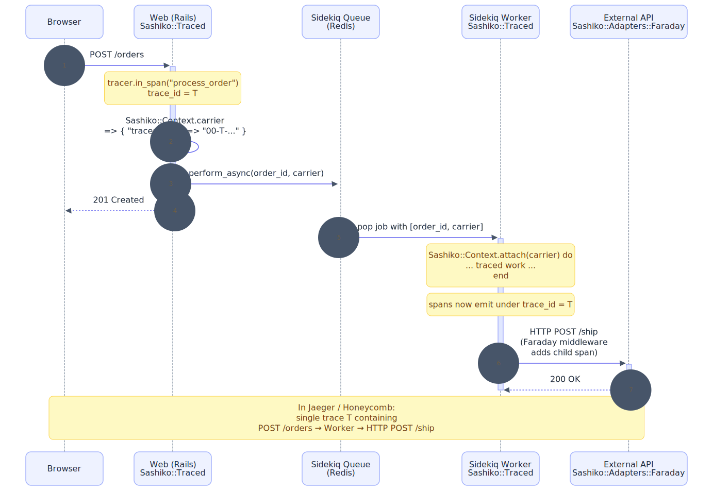
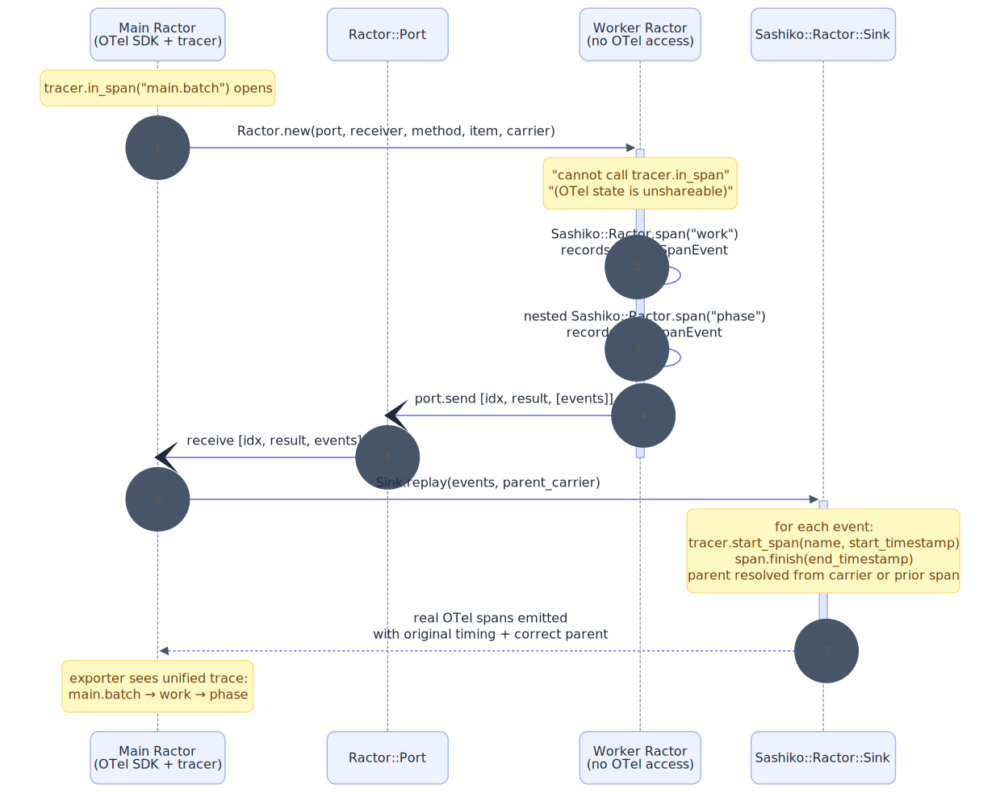

# Sashiko

**Concurrency-boundary observability for Ruby on top of OpenTelemetry.**

The OTel context is fiber-local. The moment work crosses a Thread, Fiber,
queue, or Ractor boundary, vanilla OpenTelemetry Ruby drops the trace —
spans from the spawned work become *root spans*, disconnected from the
request that started them. Sashiko keeps the trace stitched together
across every concurrency boundary Ruby has, with a small declarative
DSL for instrumenting your own code.

[](https://github.com/O6lvl4/sashiko/actions/workflows/test.yml)
[](https://github.com/O6lvl4/sashiko/actions/workflows/typecheck.yml)
[](https://o6lvl4.github.io/sashiko/)

API docs: <https://o6lvl4.github.io/sashiko/>

> Status: early. API may change. Tests green in both default and
> `RUBY_BOX=1` modes; 0 type errors.

Named after *sashiko* (刺し子), a Japanese stitching technique that
reinforces fabric with small, deliberate stitches.

## The boundary problem

```
Without Sashiko:                          With Sashiko:

[trace A]                                 [trace A]
└─ POST /orders                           └─ POST /orders
                                             ├─ external_call
[trace B]   ← orphan thread span 😢          ├─ external_call
└─ external_call                             └─ external_call
[trace C]   ← orphan thread span 😢
└─ external_call
```

A 30-line runnable demonstration is in
[`examples/thread_fanout_demo.rb`](examples/thread_fanout_demo.rb).
It prints both trace trees side-by-side from the same code.

## What it gives you

- **Boundary-aware Context helpers** — `Sashiko::Context.thread`,
  `.fiber`, `.parallel_map` preserve the OTel Context across Ruby's
  in-process concurrency primitives. `Sashiko::Context.carrier` returns
  a deep-frozen, Ractor-shareable Hash of W3C Trace Context headers
  that survives Sidekiq job args, Kafka message attributes, HTTP
  headers, and `Ractor.new(...)` arguments — `Sashiko::Context.attach`
  reconnects the trace on the other side.
- **Declarative span DSL** — `extend Sashiko::Traced; trace :method`
  instead of `tracer.in_span { ... }` blocks. Exceptions and error
  status are recorded automatically.
- **Spans from inside a Ractor** — vanilla OTel Ruby raises
  `Ractor::IsolationError` on `tracer.in_span` inside a Ractor.
  Sashiko records the work as plain `SpanEvent` data inside the
  Ractor and *replays* it as real OTel spans on the main Ractor,
  with the original timestamps and parent linkage. Caveats below.
- **Per-Box (per-tenant) instrumentation** — under `RUBY_BOX=1`, each
  `Sashiko::Box.new` gets its own Sashiko and OTel SDK. Useful for
  multi-tenant processes; see the Box section for known constraints.
- **Tracer DI everywhere** — every public entry point accepts a
  `tracer:` keyword that bypasses the global memoized tracer. The
  recommended escape hatch for routing spans through a non-default
  provider (Box-local, alt backend, test fixture).
- **Typed** — ships RBS signatures, type-checked with Steep in CI.

Sashiko is intended as a **companion** to the SIG-maintained
`opentelemetry-instrumentation-*` gems, not a replacement. Use those
for Rails / Sidekiq / Faraday / etc.; reach for Sashiko for the
custom-code parts and the boundary handoffs they don't cover.

## When to use Sashiko

OpenTelemetry has three signal types — *traces*, *metrics*, and
*logs*. **Sashiko is tracing-only.** It does not emit metrics or
logs, and it is not an analytics platform.

✅ **Use Sashiko if you have:**

- A Ruby backend (Rails / Sidekiq / Hanami / custom workers) using
  OpenTelemetry, or planning to.
- Code that spawns parallel work via `Thread` / `Fiber` / `parallel_map`
  / `Ractor`, and you want the spans to stay connected to the parent
  request.
- Sidekiq / ActiveJob / Kafka / custom queue work where you want
  the trace continuous across the queue boundary.
- Ractor-based CPU-bound work that you want traced (vanilla OTel
  raises `Ractor::IsolationError` when you try to emit spans from
  inside a Ractor; Sashiko's span replay handles it).
- Multi-tenant Ruby processes via `Ruby::Box` where each tenant
  should get its own OTel pipeline.

❌ **Don't use Sashiko for:**

- **Web / mobile analytics** (page views, conversions, user
  cohorts) — use Google Analytics, Mixpanel, Amplitude.
  OpenTelemetry traces are not analytics events.
- **Application metrics** (counters, gauges, histograms, real-time
  dashboards) — use OpenTelemetry metrics + Prometheus / Grafana.
- **Application logs** — use lograge / structured logging / OTel
  logs. Sashiko does not handle logs.
- **Frameworks that already have first-party OTel support** (Rails,
  Sidekiq, Faraday, gRPC, …) — pick up the corresponding
  `opentelemetry-instrumentation-*` SIG gem instead. Use Sashiko
  for *your own code* that lives next to those frameworks.

The shortest discriminator: if your question is **"why did this
particular request take 3 seconds and where was the time spent"**,
Sashiko is in scope. If your question is **"how many users converted
last week"** or **"what is our p99 latency over time"**, it isn't.

## Requirements

- Ruby 4.0 or later (4.0.0 shipped 2025-12-25)
- `opentelemetry-api` `~> 1.4`
- `opentelemetry-sdk` `~> 1.5`

`Ruby::Box` and `Ractor::Port`-backed features need Ruby 4.0+. Box is
opt-in via `RUBY_BOX=1` and is flagged experimental upstream — see
[Misc #21681](https://bugs.ruby-lang.org/issues/21681).
The Thread, Fiber, queue, and HTTP boundary helpers work on any Ruby
3.x tested release, but the gem currently targets 4.0+ only because
adapters use `Data.define` and other 3.2+ idioms.

## Quick start

```ruby
# Gemfile
gem "sashiko", "~> 0.1"
gem "opentelemetry-sdk"
gem "opentelemetry-exporter-otlp"
```

(While `0.x.x`, expect the API to change. Pin to a patch version if
you want zero surprises. Pre-1.0 follows Keep-a-Changelog style — see
[`CHANGELOG.md`](CHANGELOG.md) for migration notes between releases.)

```ruby
# config/initializers/otel.rb
require "opentelemetry/sdk"
require "opentelemetry/exporter/otlp"

OpenTelemetry::SDK.configure { it.service_name = "my-app" }

require "sashiko"
```

```ruby
class OrderService
  extend Sashiko::Traced

  trace :checkout, attributes: ->(order) { { "order.id" => order.id } }
  def checkout(order)
    charge(order)
    notify(order)
  end

  trace :charge
  trace :notify
  def charge(order); ...; end
  def notify(order); ...; end
end
```

Every call to `checkout` produces a span named `OrderService#checkout`,
with `charge` and `notify` as children. Exceptions are recorded and the
span is marked errored automatically.

## Core API

### `Sashiko::Traced` — declarative spans

```ruby
class Svc
  extend Sashiko::Traced

  # Wrap a single method.
  trace :work, attributes: ->(x) { { "work.id" => x.id } }

  # Wrap every method matching a pattern (declare AFTER the defs).
  trace_all matching: /^handle_/
end
```

`trace` options:
- `name:` — override the span name (defaults to `ClassName#method`).
- `kind:` — `:internal` (default), `:client`, `:server`, etc.
- `attributes:` — a `Proc` receiving call args, or a static `Hash`.
- `record_args: true` — include arg count as `code.args.count`.

Implementation: one anonymous module is `prepend`ed per target class at
trace time; subsequent `trace` calls redefine methods on the same overlay,
keeping `super` chains intact.

### `Sashiko::Context` — propagation across Thread / Fiber

```ruby
# Thread.new that preserves the current OTel Context.
Sashiko::Context.thread { do_work }.join

# Fiber.new likewise.
Sashiko::Context.fiber { do_work }.resume

# Fan-out helper: one thread per item, all with the captured Context,
# results returned in input order.
results = Sashiko::Context.parallel_map(jobs) { |j| process(j) }
```

Without these helpers, plain `Thread.new` drops the OTel Context and
your spans become orphans.

### `Sashiko::Context.carrier` — across processes, queues, Ractors

The same primitive works for any boundary where you can pass strings:

```ruby
# Producer side: capture the current trace context as a serializable Hash.
queue.push(payload: "...", trace_context: Sashiko::Context.carrier)

# Worker side: re-attach it before doing traced work.
job = queue.pop
Sashiko::Context.attach(job[:trace_context]) do
  process(job)
end
```

`carrier` is a deep-frozen, `Ractor`-shareable Hash of W3C Trace Context
headers (`traceparent`, `tracestate`). It survives JSON serialization,
Sidekiq job args, Kafka message attributes, HTTP headers, and
`Ractor.new(...)` arguments.



### `Sashiko::Ractor` — parallel execution with span replay

For CPU-bound work that should actually use multiple cores:

```ruby
module PrimePipeline
  def self.run(upper_bound)
    candidates = Sashiko::Ractor.span("enumerate") { (2..upper_bound).to_a }
    primes     = Sashiko::Ractor.span("sieve")     { candidates.select { |i| (2..Math.sqrt(i)).none? { |d| i % d == 0 } } }
    Sashiko::Ractor.span("summarize", attributes: { "prime.count" => primes.length }) { primes.last }
  end
end

Sashiko.tracer.in_span("main.batch") do
  Sashiko::Ractor.parallel_map([5_000, 10_000, 15_000], via: PrimePipeline.method(:run))
end
```

How it works:

1. Each item runs in its own Ractor (true parallelism, no GVL).
2. Inside each Ractor, `Sashiko::Ractor.span(...)` records a frozen
   `SpanEvent` (name, start/end ns, attributes, parent event id) — *no
   OTel calls, because those don't work inside a Ractor*.
3. When the Ractor finishes, the batch of events is sent back via
   `Ractor::Port` to the main Ractor.
4. A `Sashiko::Ractor::Sink` on the main side calls
   `tracer.start_span(..., start_timestamp: …)` /
   `span.finish(end_timestamp: …)` for each event, rebuilding the parent
   chain from the recorded event ids, all under the context of the span
   that wrapped `parallel_map`.

Resulting tree:

```
main.batch (20ms)                              ← main Ractor
├─ PrimePipeline.run (7.5ms) [item.index=0]    ← recorded inside a Ractor
│  ├─ enumerate                                ← ← nested Ractor-side span
│  ├─ sieve
│  └─ summarize
├─ PrimePipeline.run (13.5ms) [item.index=1]
│  └─ ...
└─ PrimePipeline.run (19.7ms) [item.index=2]
   └─ ...
```



```sh
bundle exec ruby examples/ractor_span_replay_demo.rb
```

**Caveats — what "replay" does and doesn't preserve:**

- `trace_id` / `span_id` are assigned by the **main-side** tracer at
  replay time; the Ractor never sees a real `SpanContext`. Parent linkage
  inside the replayed batch is correct, and the batch's root attaches to
  whatever main-side context wrapped `parallel_map`.
- `OpenTelemetry::Baggage` set inside the Ractor is **not** propagated
  out; only what's in `Sashiko::Context.carrier` at `parallel_map` time
  reaches the replay.
- Sampling is decided at replay time on the main side, not when the work
  actually ran.
- Constraints: `via:` must be a `Method` whose receiver is
  Ractor-shareable (a `Module` or frozen class). Nested spans inside the
  Ractor must use `Sashiko::Ractor.span` — `tracer.in_span` would crash.

For threads, prefer `Sashiko::Context.thread` / `parallel_map` — Ractor
replay is for genuine multi-core CPU work.

### `Sashiko::Box` — per-Box instrumentation (Ruby 4, experimental)

Vanilla `Module#prepend`-based instrumentation is process-global: once
you patch `Anthropic::Messages` for tenant A, tenant B inherits the
patch. `Ruby::Box` provides a separate loading namespace, so each Box
can have its own instrumented classes, OTel tracer provider, and exporter.

```ruby
# Run with: RUBY_BOX=1 bundle exec ruby your_script.rb

tenant_a = Sashiko::Box.new
tenant_a.eval(<<~RUBY)
  OpenTelemetry::SDK.configure { |c| c.service_name = "tenant-a" }
  # ... tenant-a's business code + instrumentation ...
RUBY

tenant_b = Sashiko::Box.new
tenant_b.eval(<<~RUBY)
  OpenTelemetry::SDK.configure { |c| c.service_name = "tenant-b" }
RUBY
```

`Sashiko::Box.new` creates a `Ruby::Box` with Sashiko already required
inside. It raises `NotEnabledError` if the process wasn't started with
`RUBY_BOX=1`. For a bare box without Sashiko, use `Ruby::Box.new`
directly.

> **Inside a Box, pass a `tracer:` explicitly.** Ruby::Box does isolate
> `OpenTelemetry.tracer_provider` (each Box has its own object). The
> reason `Sashiko.tracer` doesn't follow it is that the method is
> defined under a `respond_to?(:tracer)` guard at require time — when
> sashiko is re-required inside a Box, the guard skips redefinition,
> so the existing method body (whose constant resolution scope was
> main's) keeps returning main's tracer. The behavior is reproducible
> in [`examples/talk/06_box_otel_pollution.rb`](examples/talk/06_box_otel_pollution.rb).
>
> Every place Sashiko emits a span accepts an explicit `tracer:` that
> bypasses the default lookup:
>
> ```ruby
> tracer = OpenTelemetry.tracer_provider.tracer("my-component")
>
> # Per-method
> trace :foo, tracer: tracer
>
> # Or every method
> trace_all matching: /^handle_/, tracer: tracer
>
> # Adapters
> f.use Sashiko::Adapters::Faraday::Middleware, tracer: tracer
> Sashiko::Adapters::Anthropic.instrument!(Anthropic::Messages, tracer: tracer)
>
> # Ractor
> Sashiko::Ractor.parallel_map(items, via: M.method(:run), tracer: tracer)
> ```
>
> `Sashiko::Adapters::Anthropic.instrument_in_box!` does this binding
> for you automatically when called with a Box.


For instrumenting a specific class only inside a box:

```ruby
box = Sashiko::Box.new
box.eval('require "anthropic"')
Sashiko::Adapters::Anthropic.instrument_in_box!(box, "Anthropic::Messages")
```

Caveats: `Ruby::Box` is experimental in Ruby 4.0. Known upstream issues
include native-extension loading, `bundler/inline`, and parts of
`active_support` failing under Box. See
[Misc #21681](https://bugs.ruby-lang.org/issues/21681) for the roadmap.

See [`examples/box_multitenant_demo.rb`](examples/box_multitenant_demo.rb)
for a runnable demo.

## Adapters

Adapters are not loaded by default — require them explicitly. The core
gem has zero vendor-specific code.

### Faraday

```ruby
require "sashiko/adapters/faraday"

conn = Faraday.new("https://api.example.com") do |f|
  f.use Sashiko::Adapters::Faraday::Middleware
end
```

Produces client-kind spans named after the HTTP method (`GET`, `POST`,
etc.) per OTel HTTP semantic conventions, with the standard request /
response attributes (`http.request.method`, `url.full`, `server.address`,
`server.port`, `http.response.status_code`, `error.type`).

### Anthropic (optional, may move to a separate gem)

```ruby
require "sashiko/adapters/anthropic"

Sashiko::Adapters::Anthropic.instrument!(Anthropic::Messages)
```

Produces GenAI semantic-convention spans on every `messages.create` call,
including token counts, cache hit ratio, and an estimated USD cost.
Pricing is a frozen `Data.define(Price)` value, deep-frozen at load time;
override via `Sashiko::Adapters::Anthropic.pricing =`.

> The Anthropic adapter is **outside Sashiko's core "concurrency-boundary
> observability" scope** and is shipped here as a working reference.
> It may be extracted into a `sashiko-anthropic` gem in a future release;
> any move will be announced in the CHANGELOG with a deprecation notice.
> Model names, pricing, and the GenAI semantic conventions are still
> moving targets — treat this adapter as a convenience, not a stable
> contract.

## Types

```sh
bundle exec rake typecheck
```

```
..........
No type error detected. 🫖
```

If you embed Sashiko in your own Steep project, add the sig path:

```ruby
# Steepfile
target :app do
  signature "sig"
  signature "vendor/bundle/ruby/4.0.0/gems/sashiko-*/sig"
  check "app"
end
```

## Examples

The full list with one-line descriptions and a quick-reference shell
block is in [`examples/README.md`](examples/README.md). Highlights:

- [`examples/thread_fanout_demo.rb`](examples/thread_fanout_demo.rb) —
  before/after of `Thread.new` losing OTel context vs.
  `Sashiko::Context.parallel_map` keeping it. *Start here.*
- [`examples/queue_demo.rb`](examples/queue_demo.rb) — producer enqueues
  jobs; workers continue the same distributed trace.
- [`examples/ractor_span_replay_demo.rb`](examples/ractor_span_replay_demo.rb)
  — each Ractor records nested spans; the main side reconstructs them as
  one trace tree.
- [`examples/box_multitenant_demo.rb`](examples/box_multitenant_demo.rb)
  — two tenants share one Ruby process. Requires `RUBY_BOX=1`.

## Development

```sh
bundle install
bundle exec rake test    # run tests
bundle exec rake docs    # generate RDoc to doc/
```

## Appendix: Ruby version targeting

Sashiko targets Ruby 4.0+ today. The boundary helpers
(`Context.thread/fiber/parallel_map/carrier/attach`) and the
`Traced` DSL would also work on Ruby 3.2+ — the floor is set by
two specifically-4.0 capabilities and a handful of 3.x idioms used
throughout the codebase.

Ruby 4.0-specific:

| Feature | Where in Sashiko |
|---|---|
| `Ractor::Port` | `Sashiko::Ractor.parallel_map` — Port-based result collection. |
| `Ruby::Box` | `Sashiko::Box.new` and `Sashiko::Adapters::Anthropic.instrument_in_box!` — per-Box instrumentation. Tests run in both default and `RUBY_BOX=1` modes in CI. |

Ruby 3.x idioms applied where they help:

| Feature | Where in Sashiko |
|---|---|
| `Data.define` (3.2+) | `Sashiko::Traced::Options`, `Adapters::Anthropic::Price`, `Ractor::SpanEvent` — frozen, Ractor-shareable values. |
| Pattern matching (3.0+) | Attribute extraction in `Traced`, HTTP status classification in Faraday adapter, GenAI response disjunction in Anthropic adapter. |
| `Ractor.make_shareable` (3.0+) | `Sashiko::Context.carrier` returns a deep-frozen, Ractor-shareable Hash. `DEFAULT_PRICING` is shareable too. |
| Endless methods (3.0+), anonymous block forwarding (3.1+) | Used in `lib/` where they remove a line without obscuring intent. |
| `it` block param (3.4+) | Used in tests and examples; `lib/` keeps named block params for now since Steep does not yet recognize `it`. |
| RBS + Steep | `sig/sashiko.rbs`, type-checked in CI. |

Class-load-time `Module#prepend` is the only mechanism used for
instrumentation; no `method_added` hooks, no runtime `define_method` at
call time. Inline caches stay warm.

## License

MIT.
